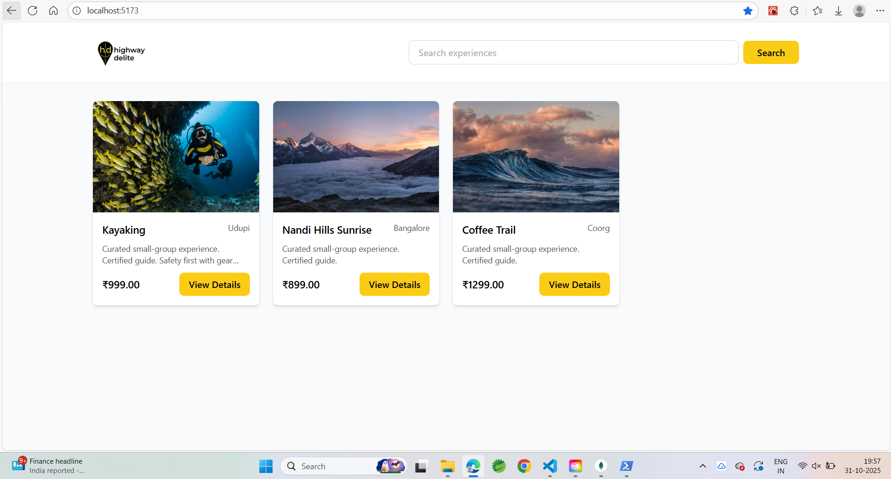
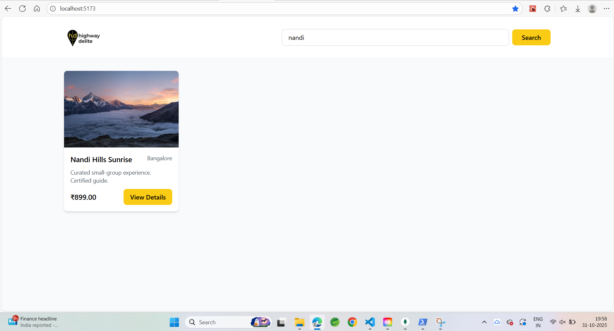
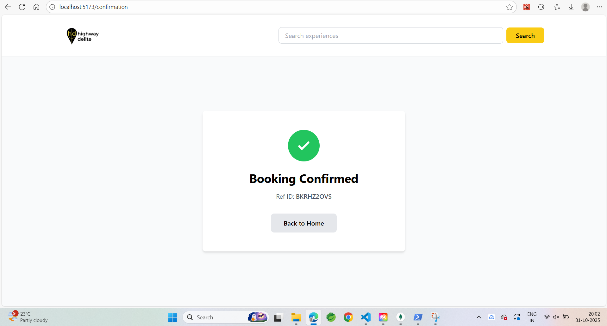

# 🧭 Bookit – Highway Delite Experience Booking Platform

A full-stack web application that allows users to browse unique travel experiences, view details, select available slots, and confirm bookings with optional promo codes and automatic tax calculation.

---

## 🧱 Table of Contents

1. [Overview](#overview)
2. [Features](#features)
3. [Tech Stack](#tech-stack)
4. [Project Structure](#project-structure)
5. [Setup Instructions](#setup-instructions)
6. [API Endpoints](#api-endpoints)
7. [Environment Variables](#environment-variables)
8. [Screenshots](#screenshots)
9. [Assignment Compliance Checklist](#assignment-compliance-checklist)

---

## 🪄 Overview

**Bookit** is an experience booking platform built for **Highway Delite**, where users can:

* Explore travel experiences across different categories.
* View experience details including description, images, and pricing.
* Select preferred **date** and **time slots** dynamically.
* Apply **promo codes** and view live discount calculations.
* Confirm and review bookings with an auto-generated reference ID.

---

## ✨ Features

✅ Responsive UI built with React + Tailwind
✅ Slot-based booking system
✅ Date & time selection with live availability
✅ Promo code validation
✅ Checkout with automatic tax & discount calculation
✅ Confirmation page with booking reference
✅ Persistent Header with logo + search bar
✅ RESTful backend with Express + MongoDB

---

## ⚙️ Tech Stack

### **Frontend**

* React (Vite + TypeScript)
* Tailwind CSS v4.x
* Lucide Icons

### **Backend**

* Node.js + Express.js
* MongoDB + Mongoose
* dotenv for environment config
* CORS enabled REST API

---

## 🗂️ Project Structure

```
bookit/
├── frontend/
│   ├── src/
│   │   ├── components/
│   │   │   ├── Header.tsx
│   │   │   ├── ExperienceCard.tsx
│   │   │   ├── DateSelector.tsx
│   │   │   └── TimeSlotSelector.tsx
│   │   ├── pages/
│   │   │   ├── HomePage.tsx
│   │   │   ├── DetailsPage.tsx
│   │   │   ├── CheckoutPage.tsx
│   │   │   └── ConfirmationPage.tsx
│   │   ├── services/
│   │   │   └── api.ts
│   │   ├── types/
│   │   │   └── index.ts
│   │   ├── App.tsx
│   │   └── main.tsx
│   ├── package.json
│   ├── vite.config.ts
│   └── tailwind.config.js
│
├── backend/
│   ├── src/
│   │   ├── config/
│   │   │   └── database.js
│   │   ├── controllers/
│   │   │   ├── experienceController.js
│   │   │   ├── bookingController.js
│   │   │   └── promoController.js
│   │   ├── models/
│   │   │   ├── Experience.js
│   │   │   ├── Slot.js
│   │   │   ├── Booking.js
│   │   │   └── PromoCode.js
│   │   ├── routes/
│   │   │   ├── experiences.js
│   │   │   ├── bookings.js
│   │   │   └── promo.js
│   │   ├── utils/
│   │   │   └── seedData.js
│   │   └── server.js
│   ├── package.json
│   └── .env
│
└── README.md
```

---

## 🚀 Setup Instructions

### 🧩 1. Clone Repository

```bash
git clone https://github.com/hardhikbangera/bookit-web.git
cd bookit
```

### 🖥️ 2. Backend Setup

```bash
cd backend
npm install
```

**Create a `.env` file**:

```env
PORT=5000
MONGO_URI=mongodb://localhost:27017/bookit
NODE_ENV=development
```

Run server:

```bash
npm run dev
```

Backend will start at **[http://localhost:5000](http://localhost:5000)**

---

### 💻 3. Frontend Setup

```bash
cd ../frontend
npm install
```

Create a `.env` file:

```env
VITE_API_URL=http://localhost:5000/api
```

Run frontend:

```bash
npm run dev
```

Frontend runs on **[http://localhost:5173](http://localhost:5173)**

---

## 🔗 API Endpoints

### **Experiences**

| Method | Endpoint               | Description                        |
| ------ | ---------------------- | ---------------------------------- |
| GET    | `/api/experiences`     | Fetch all experiences              |
| GET    | `/api/experiences/:id` | Fetch experience details and slots |

### **Bookings**

| Method | Endpoint        | Description      |
| ------ | --------------- | ---------------- |
| POST   | `/api/bookings` | Create a booking |

### **Promo Codes**

| Method | Endpoint              | Description         |
| ------ | --------------------- | ------------------- |
| POST   | `/api/promo/validate` | Validate promo code |

---

## 🌐 Environment Variables Summary

| Variable       | Location      | Description               |
| -------------- | ------------- | ------------------------- |
| `VITE_API_URL` | frontend/.env | Base API URL for frontend |
| `PORT`         | backend/.env  | Backend server port       |
| `MONGO_URI`    | backend/.env  | MongoDB connection string |

---

## 📸 Screenshots


| Home Page                     | Search Page                        | Details Page                        | Checkout                              | Confirmation                                  |
| ----------------------------- | ----------------------------------- | ------------------------------------- | --------------------------------------------- |
|  |  |  |  |

---

## ✅ Assignment Compliance Checklist

| Requirement                      | Status |
| -------------------------------- | :----: |
| React + Tailwind frontend        |    ✅   |
| Node.js + Express backend        |    ✅   |
| MongoDB database                 |    ✅   |
| Date & Time slot selection       |    ✅   |
| Promo code discount logic        |    ✅   |
| Taxes auto-calculated (5.9%)     |    ✅   |
| Booking confirmation page        |    ✅   |
| Responsive & clean UI            |    ✅   |
| Common Header with logo + search |    ✅   |
| API documentation & .env setup   |    ✅   |
| Readme with setup steps          |    ✅   |
| Screenshots placeholders added   |    ✅   |

---

## 🧑‍💻 Author / Contributors

**Developed by:** *Hardhik*
*Under the Highway Delite Assignment Submission.*

---
